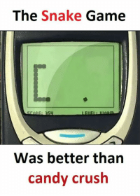
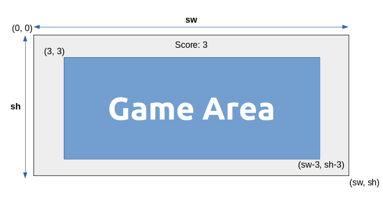
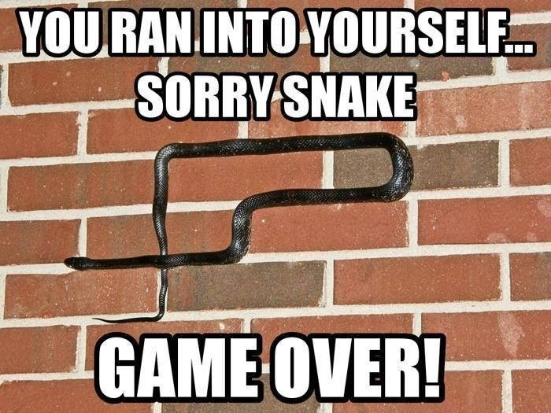

# <center><u>Introduction to curses in Python (Part-3)</u></center><br><center>Creating a Snake Game</center>



## 1. Creating a game box area

Instead of covering the whole screen, we would like to use a rectangular box as our game area. Remaining parts can be used for showing some other useful info like score, remaining attempts, etc.

> The `curses.textpad` module provides a `Textbox` class that handles elementary text editing in a curses window. The module also provides a rectangle-drawing function useful for framing text boxes or for other purposes.


### `textpad.rectangle(stdscr, uly, ulx, lry, lrx)`

Draws a rectangle. The first argument must be a window object; the remaining arguments are coordinates relative to that window. The second and third arguments are the y and x coordinates of the upper left hand corner of the rectangle to be drawn; the fourth and fifth arguments are the y and x coordinates of the lower right hand corner.




From the diagram shown above, the game area box has coordinates:
- upper-left corner: `(3,3)`
- lower-right corner: `(sw-3, sh-3)`

where `sh` and `sw` are screen height and width, respectively.

So, we define box coordinates as:

```python
box = [[3,3], [sh-3, sw-3]]
```

**Note:** curses follows `(y,x)` system to represent coordinates.

Now, rectangle can be drawn as:

```python
textpad.rectangle(stdscr, box[0][0], box[0][1], box[1][0], box[1][1])
```

## Example 7

```python
import curses
from curses import textpad


def main(stdscr):
	curses.curs_set(0)
	sh, sw = stdscr.getmaxyx()
	box = [[3,3], [sh-3, sw-3]]
	textpad.rectangle(stdscr, box[0][0], box[0][1], box[1][0], box[1][1])
	stdscr.getch()


curses.wrapper(main)
```

Let's create the snake game now!

## Example 8

```python
import curses
import time
import random
from curses import textpad


def create_food(snake ,box):
    food = None

    while food is None:
        food = [random.randint(box[0][0] + 1 , box[1][0] -1) ,
                random.randint(box[0][1] + 1 , box[1][1] -1) ]

        if food in snake:
            food = None
    return food


def print_score(stdcr,score):
    sh , sw = stdcr.getmaxyx()
    score_text = "Score : "+str(score)
    stdcr.addstr(1 , sw//2 - len(score_text) , score_text)
    stdcr.refresh()


def main(stdcr):
    # for making the cursor invisible
    curses.curs_set(0)

    # for making no delays and waithing for userinput for 150ms
    # it is used for making snake move automatically
    stdcr.nodelay(1)
    stdcr.timeout(150)
    
    # for getting the height and width of the screen
    # the (0,0) position is at the top left in curses 
    sh , sw = stdcr.getmaxyx()


    box = [[3,3] , [sh-3,sw-3]]

    # for drawing a rectangle area
    textpad.rectangle(stdcr , box[0][0] , box[0][1] , box[1][0] , box[1][1])
    
    # initializing a screen
    snake = [
        [sh//2 , sw//2+1],
        [sh//2 , sw//2],
        [sh//2 , sw//2-1]
    ]

    # setting the snake direction to right
    direction = curses.KEY_RIGHT

    # printing the snake
    for y , x in snake:
        stdcr.addstr(y,x,'#')
        #stdcr.refresh()

    # printing the food
    food = create_food(snake , box)
    stdcr.addstr(food[0] , food[1] , '*')

    # for printing the score
    score = 0
    print_score(stdcr ,score)

    # for personal signature
    sig_text = "Made By Naheed Rayan @2021"
    stdcr.addstr(sh-1 , sw//2 - len(sig_text)//2 , sig_text) 

    while 1:
        key = stdcr.getch()

        if key in [curses.KEY_RIGHT , curses.KEY_LEFT , curses.KEY_UP ,curses.KEY_DOWN]:
            direction = key
        

        head = snake[0]

        if direction == curses.KEY_RIGHT:
            new_head = [head[0] , head[1] + 1]
        elif direction == curses.KEY_LEFT:
            new_head = [head[0] , head[1] -1 ]
        elif direction == curses.KEY_UP:
            new_head = [head[0] -1 , head[1]]
        elif direction == curses.KEY_DOWN:
            new_head = [head[0] +1 , head[1]]

        # inserting the new head
        snake.insert(0 , new_head)
        stdcr.addstr(new_head[0] , new_head[1] , '#')


        # if the snake eats the food
        if snake[0] == food:
            # for updating the score
            score += 1
            print_score(stdcr ,score)

            # for creating the food
            food = create_food(snake , box)
            stdcr.addstr( food[0] ,food[1] , '*')

        else:
            # making the last element black and poping them out
            # in this way the snake moves
            stdcr.addstr(snake[-1][0] , snake[-1][1] , ' ')
            snake.pop()
            
        # for ending the game
        if (snake[0][0] in [box[0][0] , box[1][0]] or
            snake[0][1] in [box[0][1] , box[1][1]] or
            snake[0] in snake[1:]) :

            # for initializing color
            curses.init_pair(1 ,curses.COLOR_RED ,curses.COLOR_YELLOW)
            
            msg = "Game Over!"

            # printing the message with color
            stdcr.attron(curses.color_pair(1))
            stdcr.addstr(sh//2, sw//2 - len(msg) , msg)
            stdcr.attroff(curses.color_pair(1))

            # for making infinite delay
            stdcr.nodelay(0)
            stdcr.getch()
            break


        # for refreshing the screen
        stdcr.refresh()


    
# using the wrapper class.Read the doc for more info
curses.wrapper(main)
```

