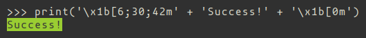

# Coloring the text


Print a string that starts a color/style, then the string, and then end the color/style change with ``'\x1b[0m'``:



Success with green background example

Get a table of format options for shell text with the following code:


```python
def print_format_table():
    """
    prints table of formatted text format options
    """
    for style in range(8):
        for fg in range(30,38):
            s1 = ''
            for bg in range(40,48):
                format = ';'.join([str(style), str(fg), str(bg)])
                s1 += '\x1b[%sm %s \x1b[0m' % (format, format)
            print(s1)
        print('\n')

print_format_table()
```


# Light-on-dark example (complete)


# Dark-on-light example (partial)


<br>
<br>

There are also other option you can see.
- [Termicolor](https://pypi.org/project/termcolor/)
- [Coloroma](https://pypi.org/project/colorama/)

<br>

# The End


