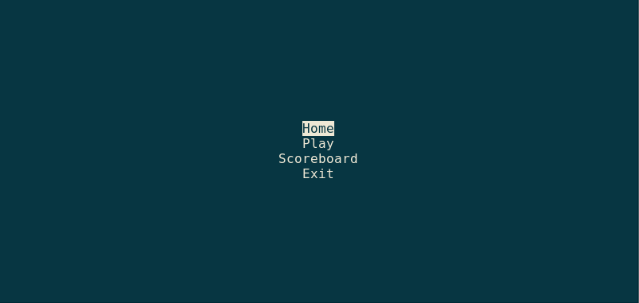
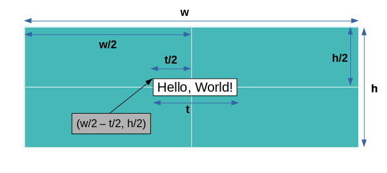
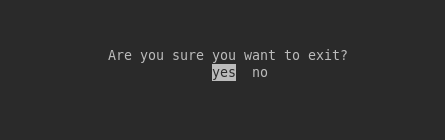

# <center><u>Introduction to curses in Python (Part-2)</u></center><br><center>Creating a Menu Display Application</center>




## 1. Printing text in center of screen

### `stdscr.getmaxyx()`

Returns a tuple `(y, x)` of the height and width of the window.

Let us assume we have to print a text `Hello, World!` in center of the screen. Then, coordinates will be:

```python
h, w = stdscr.getmaxyx()

x = w//2 - len(text)//2
y = h//2
```




## 2. Setting background and foreground color

### `curses.has_colors()`

Returns True if the terminal can display colors; otherwise, returns False.


### `curses.init_pair(pair_number, fg, bg)`

Create/update a color pair scheme for a given `pair_number`.


### `curses.color_pair(color_number)`

Returns the **attribute value** for displaying text in the specified color.


### `stdscr.attron(attr)`

Adds attribute `attr` to the “background” set applied to all writes to the current window.


### `stdscr.attroff(attr)`

Removes attribute `attr` from the “background” set applied to all writes to the current window.


Now, in order to print text with red color and yellow background,

```python

# create color pair scheme
curses.init_pair(1, curses.COLOR_RED, curses.COLOR_YELLOW)

# activate the color pair scheme
curses.attron(curses.color_pair(1))

# write something
curses.addstr(0, 0, "Hello, World!")

# deactivate the color pair scheme
curses.attroff(curses.color_pair(1))
```

## Example 3

```python
import time
import curses

def main(stdscr):
	# turn off cursor blinking
	curses.curs_set(0)

	# get height and width of screen
	h, w = stdscr.getmaxyx()

	# create a new color scheme
	curses.init_pair(1, curses.COLOR_RED, curses.COLOR_YELLOW)

	# text to be written in center
	text = "Hello, world!"

	# find coordinates for centered text
	x = w//2 - len(text)//2
	y = h//2

	# set color scheme
	stdscr.attron(curses.color_pair(1))

	# write text on screen
	stdscr.addstr(y, x, text)

	# unset color scheme
	stdscr.attroff(curses.color_pair(1))

	# update the screen
	stdscr.refresh()

	# wait for 3 sec before exit
	time.sleep(3)


curses.wrapper(main)
```

## 3. Taking user input

### `stdscr.getch()`

Get an input character.


## 4. Detecting Special Keys

For special keys like `Up`, `Down`, `Left`, `Right`, etc, `curses` has special values. You can get them like this:

- `curses.KEY_UP`
- `curses.KEY_DOWN`
- `curses.KEY_RIGHT`
- `curses.KEY_DOWN`

and so on.


Let's write a simple program to take **arrow keys** and **enter key** as input from user.

## Example 4

```python
import curses

def main(stdscr):

	while 1:
		key = stdscr.getch()

		# clear existing texts
		stdscr.clear()

		if key == curses.KEY_UP:
			stdscr.addstr(0, 0, "You pressed Up key!")
		elif key == curses.KEY_DOWN:
			stdscr.addstr(0, 0, "You pressed Down key!")
		elif key == curses.KEY_ENTER or key in [10, 13]:
			stdscr.addstr(0, 0, "You pressed Enter.")
		else:
			break

		# update screen
		stdscr.refresh()


curses.wrapper(main)
```

Having learnt all the necessary concepts, lets make a simple **Menu Display** application now.

## Example 5

```python
import curses

menu = ['Home', 'Play', 'Scoreboard', 'Exit']


def print_menu(stdscr, selected_row_idx):
	stdscr.clear()
	h, w = stdscr.getmaxyx()
	for idx, row in enumerate(menu):
		x = w//2 - len(row)//2
		y = h//2 - len(menu)//2 + idx
		if idx == selected_row_idx:
			stdscr.attron(curses.color_pair(1))
			stdscr.addstr(y, x, row)
			stdscr.attroff(curses.color_pair(1))
		else:
			stdscr.addstr(y, x, row)
	stdscr.refresh()


def print_center(stdscr, text):
	stdscr.clear()
	h, w = stdscr.getmaxyx()
	x = w//2 - len(text)//2
	y = h//2
	stdscr.addstr(y, x, text)
	stdscr.refresh()


def main(stdscr):
	# turn off cursor blinking
	curses.curs_set(0)

	# color scheme for selected row
	curses.init_pair(1, curses.COLOR_BLACK, curses.COLOR_WHITE)

	# specify the current selected row
	current_row = 0

	# print the menu
	print_menu(stdscr, current_row)

	while 1:
		key = stdscr.getch()

		if key == curses.KEY_UP and current_row > 0:
			current_row -= 1
		elif key == curses.KEY_DOWN and current_row < len(menu)-1:
			current_row += 1
		elif key == curses.KEY_ENTER or key in [10, 13]:
			print_center(stdscr, "You selected '{}'".format(menu[current_row]))
			stdscr.getch()
			# if user selected last row, exit the program
			if current_row == len(menu)-1:
				break

		print_menu(stdscr, current_row)


curses.wrapper(main)

```

## Challenge

You can try to extend the above program and present the user with a `Yes/No` horizontal menu to exit the program when user selects `Exit` option in main menu.

